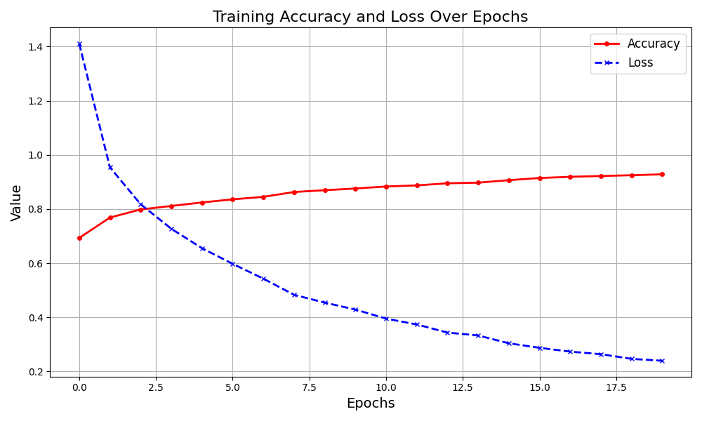
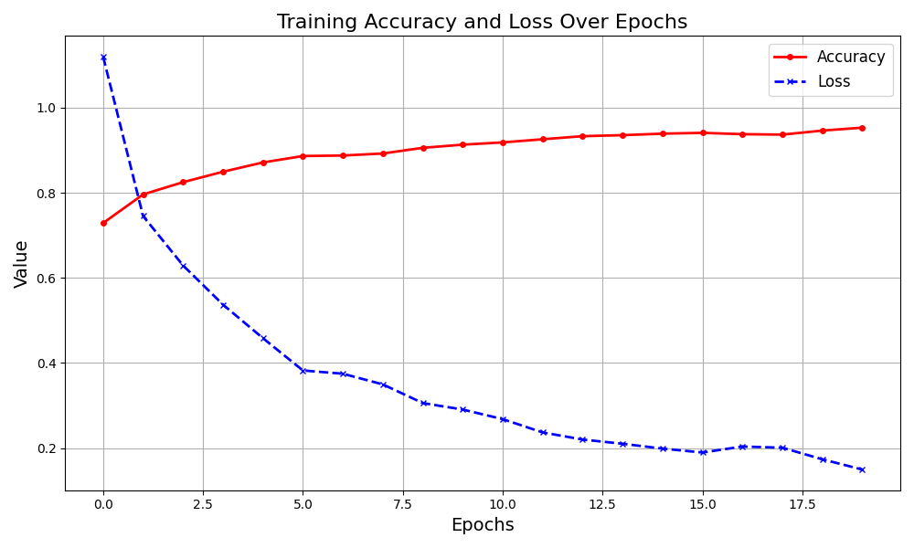
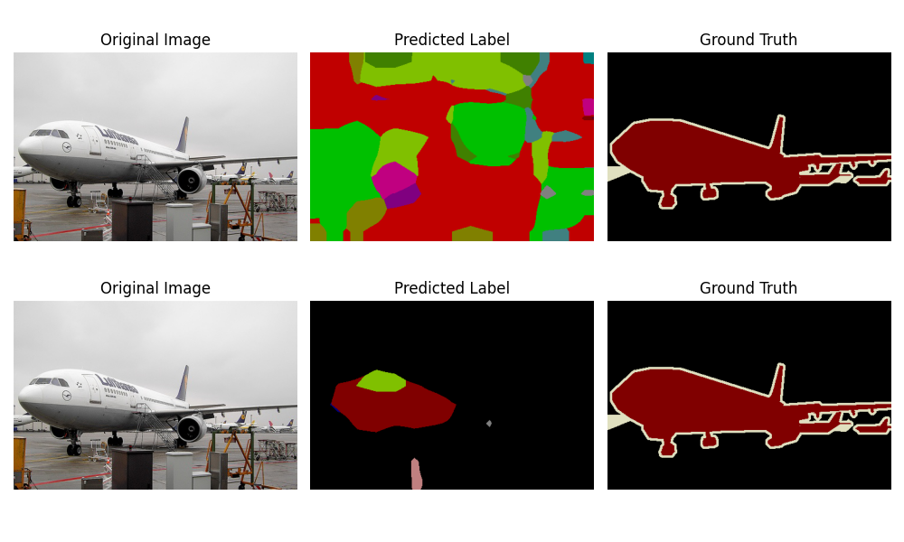
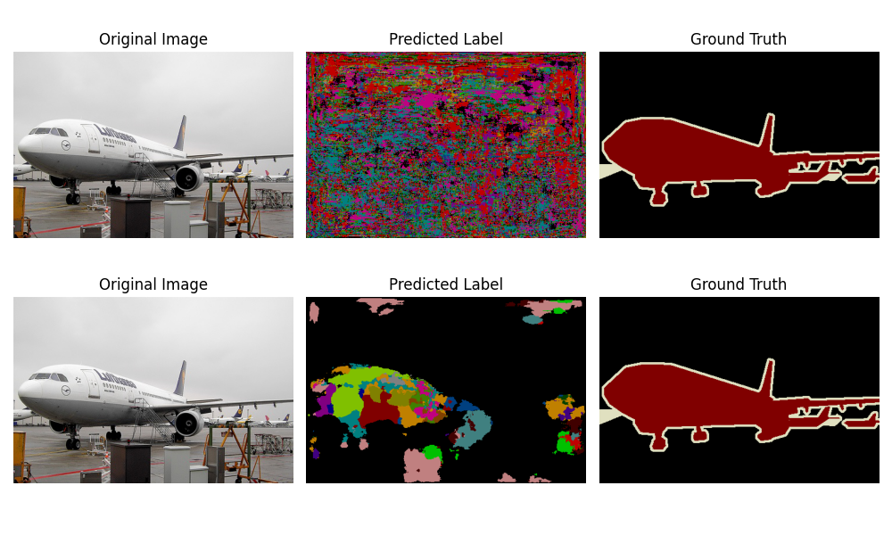
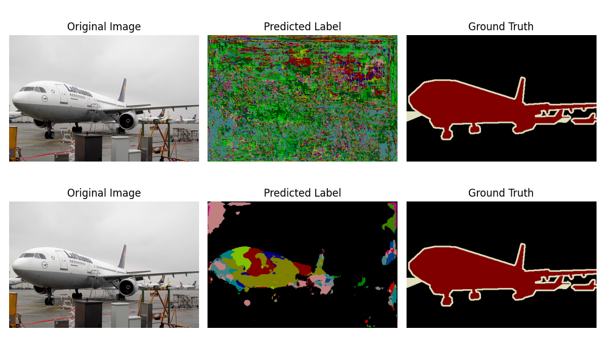
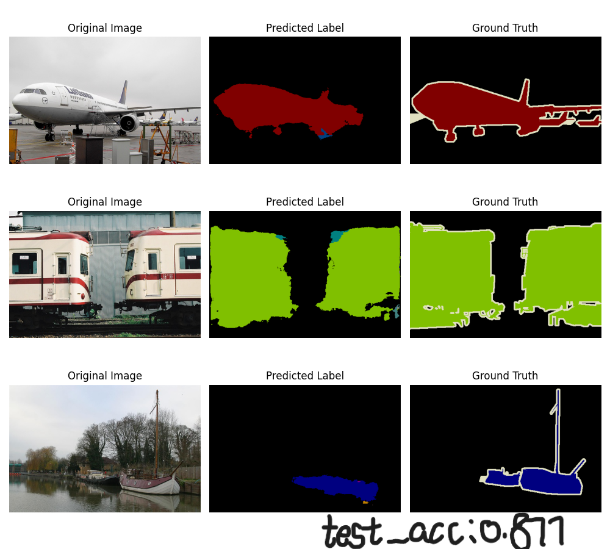
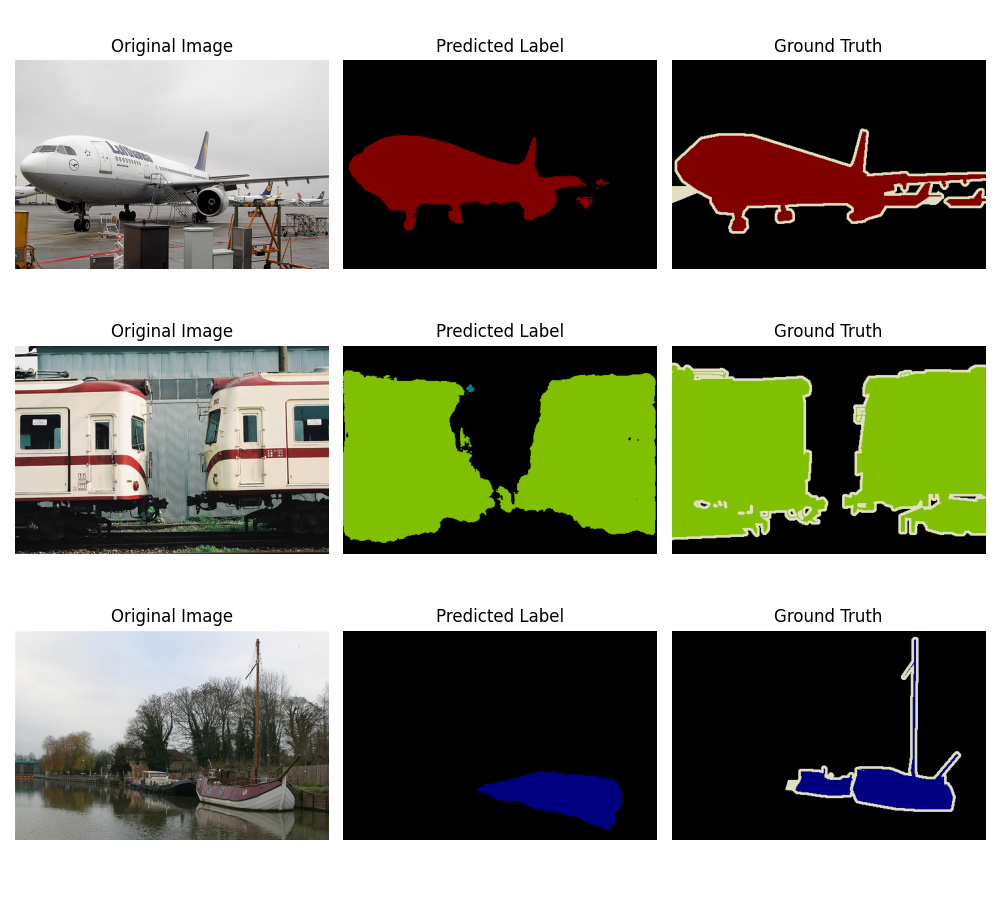

# 基于FCN和Unet对VOC数据集进行语义分割

## loss_acc

FCN：

Unet：

attentionUNet:

## 前后对比

FCN：

Unet：

attentionUNet:

## 最终效果示例

FCN:

Unet:

attentionUNet:

|               | FCN   | UNet  | attentionUNet |
| ------------- | ----- | ----- | ------------- |
| test_acc      | 0.862 | 0.877 | 0.8951        |
| max_train_acc |       |       | 0.9530        |

epoch=20, lr = 0.05,  loss = SGD

注：本次实验采用的FCN和UNet均是使用imageNet预训练好的Encoder进行训练的，采用原始的UNet进行训练时，由于参数初始化导致特征提取器有明显偏差，在进行梯度下降时易进入局部最小值，导致屡次实验在同一情况下，原始UNet出现结果为全黑但预训练的UNet结果正常的现象。