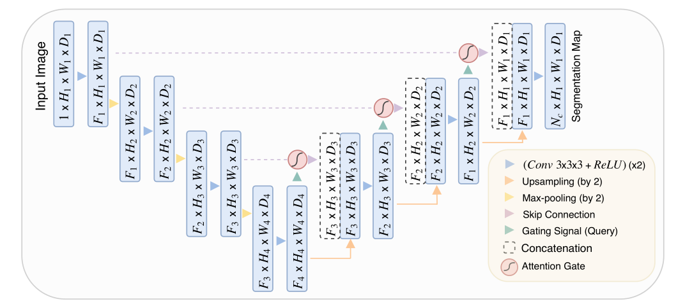
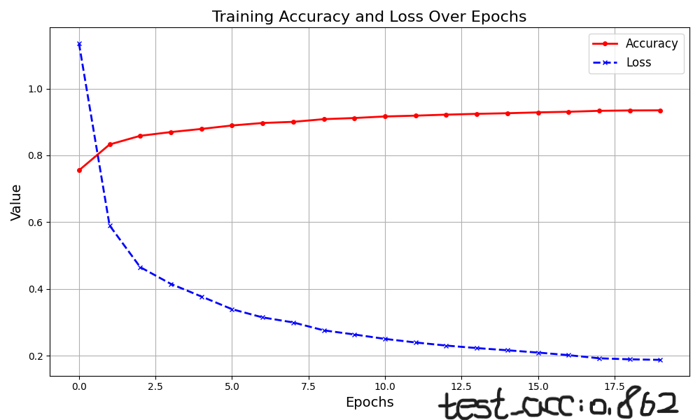
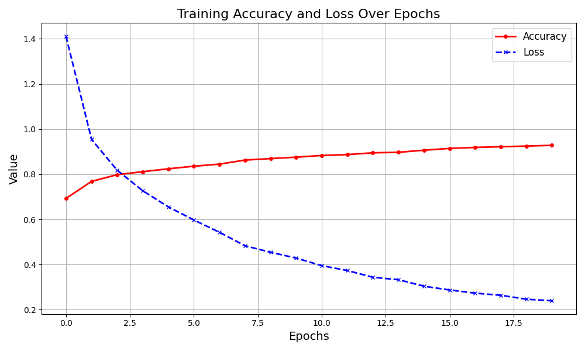
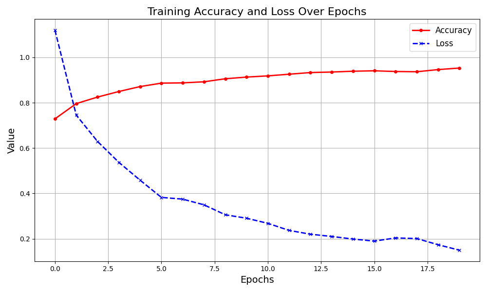
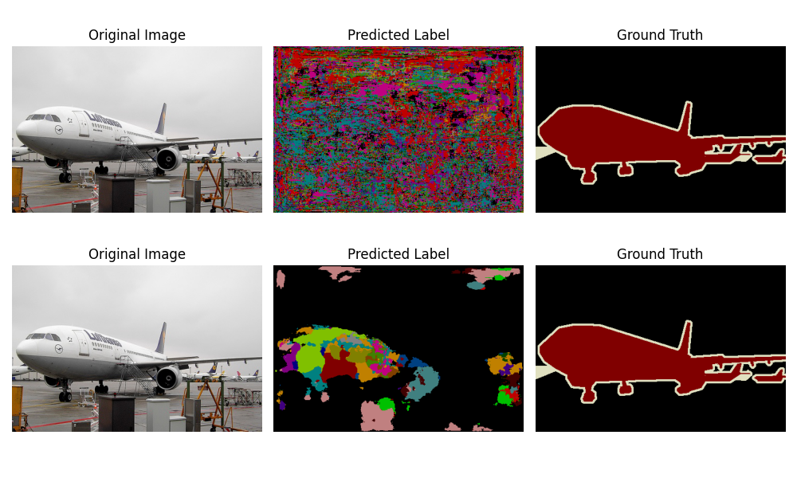
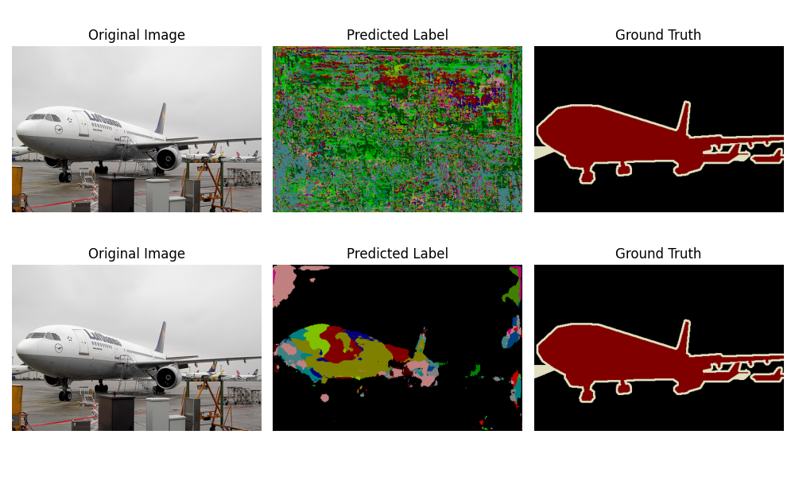
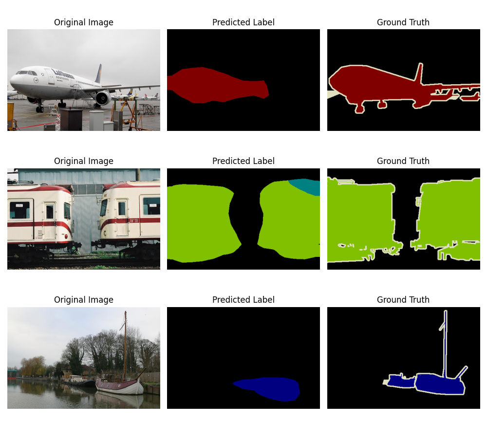
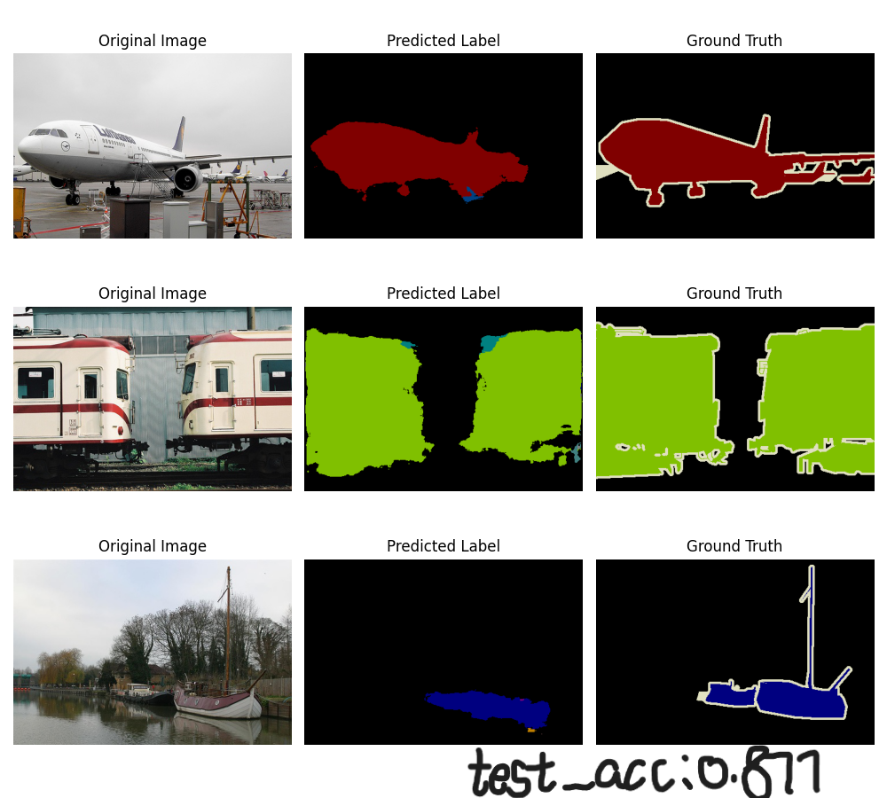
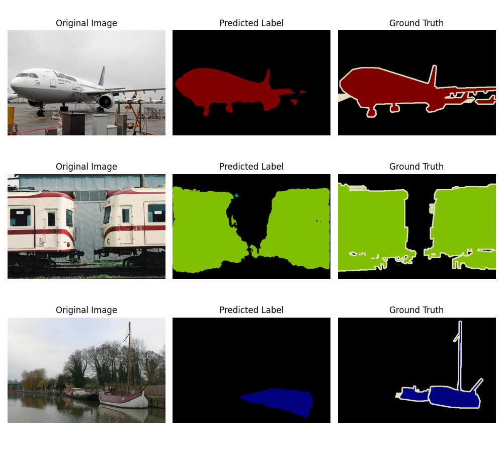

# 基于FCN和Unet对VOC数据集进行语义分割

## 笔记

### 软注意力

软注意力可以用于在一个序列或集合中选择重要的部分，它主要通过给不同的部分分配不同的权重要实现这个目标。软注意力可以给一个序列或集合的每个元素分配一个权重，而不是仅仅选择一个元素。

在NLP中，可以用于选择一个句子中最重要的单词或短语，在图像处理中，可以用于选择图像中最重要的区域。

### 硬注意力

只选择序列或集合中的一个元素作为输出，而不是对每个元素分配一个权重。

在图像处理中，它可以用于选择图像中最显著的特征或区域；在语音识别中，它可以用于选择输入音频序列中具有最大能量或最高概率的帧。

区别：

|              | 软注意力                                                     | 硬注意力                                                     |
| ------------ | ------------------------------------------------------------ | ------------------------------------------------------------ |
| 输出方式不同 | 给序列或集合中的每个元素分配一个权重，并通过加权平均的方式得到整个序列或集合的输出 | 只能选择序列或集合中的一个元素作为输出                       |
| 计算方式不同 | 使用神经网络来计算每个元素的权重                             | 通常使用贪心算法或强制性选择来确定输出序列或集合中的元素     |
| 应用场景不同 | 应用于NLP、图像处理，**用于选择一个序列或集合中的重要元素**  | 应用于图像处理和语音识别等领域，用于**选择序列或集合中最重要的元素。** |

在传统的UNet中，**为了避免在decoder时丢失大量的空间精确细节信息**，使用了skip手法，将Encoder中的特征图concat到decoder中，但是提取的低级特征有许多冗余信息。

软注意力的使用可以有效抑制无关区域中的激活，减少冗余部分的skip。

### attention gate

为了有效抑制无关区域，保留与目标信息相关的区域信息，引入了attention gate（注意力门）的机制。

**输入：** 来自编码器的高分辨率特征 (`x`) 和解码器的低分辨率特征 (`g`)。

**特征融合：** 将两者进行加权融合，生成注意力图。

**激活：** 使用激活函数（如 sigmoid）生成注意力权重。

**加权输出：** 用注意力权重对编码器特征进行加权，过滤掉无关区域。

最终将经过attention gate生成的结果与解码阶段上采样的特征concat即可。

结构如下：



代码示例：

```python
import torch
import torch.nn as nn

class AttentionGate(nn.Module):
    def __init__(self, F_g, F_l, F_int):
        super(AttentionGate, self).__init__()
        self.W_g = nn.Sequential(
            nn.Conv2d(F_g, F_int, kernel_size=1, stride=1, padding=0, bias=True),
            nn.BatchNorm2d(F_int)
        )
        
        self.W_x = nn.Sequential(
            nn.Conv2d(F_l, F_int, kernel_size=1, stride=1, padding=0, bias=True),
            nn.BatchNorm2d(F_int)
        )
        
        self.psi = nn.Sequential(
            nn.Conv2d(F_int, 1, kernel_size=1, stride=1, padding=0, bias=True),
            nn.BatchNorm2d(1),
            nn.Sigmoid()
        )
        
        self.relu = nn.ReLU(inplace=True)

    def forward(self, g, x):
        g1 = self.W_g(g)
        x1 = self.W_x(x)
        psi = self.relu(g1 + x1)
        psi = self.psi(psi)
        return x * psi

```

## loss_acc

FCN：



Unet：

attentionUNet:



## 前后对比

FCN：


Unet：



attentionUNet:



## 最终效果示例

FCN:



Unet:



attentionUNet:



|               | FCN   | UNet  | attentionUNet |
| ------------- | ----- | ----- | ------------- |
| test_acc      | 0.862 | 0.877 | 0.8951        |
| max_train_acc |       |       | 0.9530        |

epoch=20, lr = 0.05,  loss = SGD

注：本次实验采用的FCN和UNet均是使用imageNet预训练好的Encoder进行训练的，采用原始的UNet进行训练时，由于参数初始化导致特征提取器有明显偏差，在进行梯度下降时易进入局部最小值，导致屡次实验在同一情况下，原始UNet出现结果为全黑但预训练的UNet结果正常的现象。